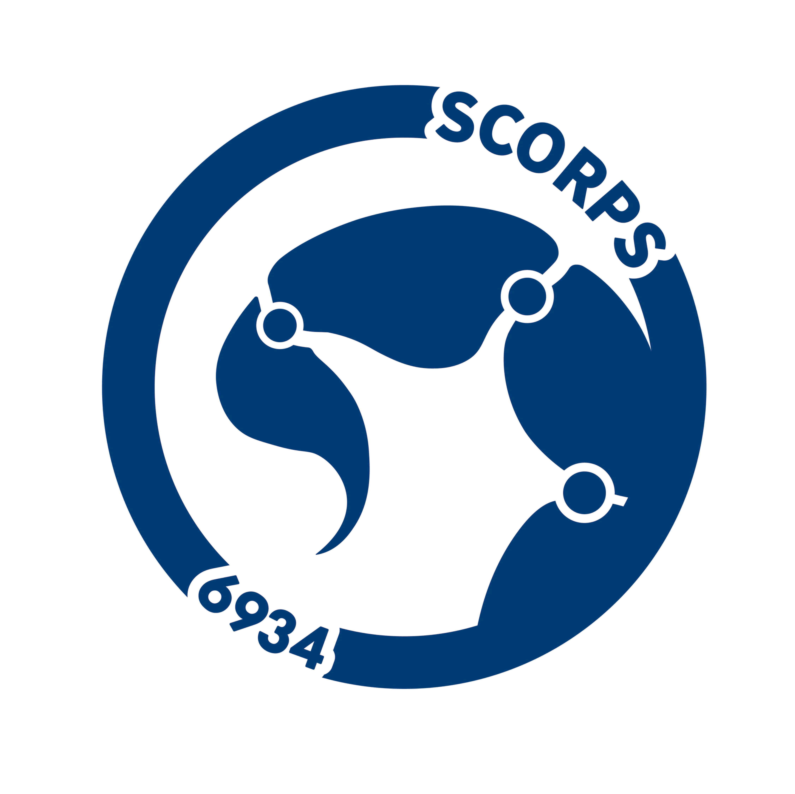

# Description: 
The current[^1] 2024-2025 robotics code for FRC team 6934.

## Changelog:  
- Updated the teleoperated swerve code for FRC 2025 1/19/25
- Updated the Kraken swerve offsets ~~(hopefully, for the final time)~~ 1/19/25
- Updated project from WIPlib version 2025.1.1 to 2025.2.1 1/22/25
- Reformatted the README file 1/22/25
- Added experimental pose component estimation methods 1/22/25
- Updated the LimelightHelpers file for FRC 2025 1/23/25
- Vision now works and properly ignores slow mode drive 1/23/25
- ~~Added an experimental vision auto positioning on-the-fly path generator (BUGGED) 1/26/25~~
- Added an experimental code for the mailbox/end-effector 2/1/25
- Added an experimental subsystem for the elevator 2/1/25
- First successful vision auto-position code created 2/5/25
- Added an experimental manual and automatic command for the elevator 2/10/25
- Final candidate code #1 for mailbox/end-effector 2/10/25
- First successful automatic command for the elevator 2/13/25
- Updated controller mapping to include automatic scoring buttons 2/16/25
- Added a test autonomous code for the elevator and end-effector 2/16/25
- Moved the auto-position code to a dedicated command file 2/24/25
- Implemented MegaTag 2 for Limelight 3/1/25
- Revamped auto-position code to use on-the-fly path generation again 3/1/25
- Added an experimental pathfinding + on-the-fly path code for driving the robot to the coral station 3/4/25
- Changed pathfinding controls to involve holding, instead of pressing, the respective button 3/6/25
- Increased elevator PID, pathfinding, and on-the-fly path speeds 3/9/25
- Added documentation for every method within VisionInfo.java and BasicOperations.java 6/1/25
- Removed unnecessary methods and variables relating to the climber code 6/1/25
- Added documentation for every method within SwerveModule.java and some explanations in Swerve.java 6/4/25
- Added documentation for basic hardware info 6/6/25

## Issues and Potential Errors:   
- Robot auto-position is still slightly off
- PID elevator sometimes does not respect its bounds and moves to the wrong position

## To-Do List:  
- [ ] Write documentation for the remainder of the code
- [ ] Fix a PID elevator issue causing it to not respect its bounds and move to the wrong position in certain scenarios
- [ ] Clean up the overuse of unit conversions in the elevator PID code

### Unused Code  
- None for now. 

### Notes  
- All code should be <ins>peer-reviewed</ins> and <ins>tested</inv>. 

## Credits  
- Source of Original Code: https://github.com/dirtbikerxz/BaseTalonFXSwerve  
- Modified Code Created By: Evan Wang, Lukas Evans, Will Redekopp, Derek Chang
- Robot "IT" Person: Ethan Jiang
- Robot Created By: FRC Robotics Team 6934 (ACHS Scorpions)  

## Falcon Swerve Chassis Configs  
> [!WARNING]
> The Falcon swerve chassis is currently out of order. Please do not change the below values until it is deemed functional again.

| Name/Component | Offset (Degrees) |
| :--- | :---: |
| Swerve Module 0 | -108.45 |
| Swerve Module 1 | 11.865 + 180 |
| Swerve Module 2 | -31.7268 |
| Swerve Module 3 | N/A (Replaced) |
| CANivore Name | "Canivor<3" |

## Kraken Swerve Chassis Configs  

| Name/Component | Offset (Degrees) |
| :--- | :---: |
| Swerve Module 0 | -47.37312 + 180 |
| Swerve Module 1 | -39.63852 |
| Swerve Module 2 | -128.320 + 180 |
| Swerve Module 3 | 108.54504 |
| CANivore Name | "Second Canivor<3" |

## Control Bindings  
### Drive Controller (**PORT 0**):   
- Field-Centric Driving: *MOVE* Left Joystick (x & y)  
- Robot-Centric Driving: *HOLD* Left Bumper + *MOVE* Left Joystick (x & y)  
- Rotating: *MOVE* Right Joystick (x)  
- Reset Gyro (Field-Centric Driving ONLY): *PRESS* Y-Button  
- Toggle Slow Mode: *PRESS* Right Button
- Auto-Position (LEFT REEF): *PRESS* X-Button
- Auto-Position (CENTER REEF): *PRESS* A-Button
- Auto-Position (RIGHT REEF): *PRESS* B-Button
- Auto-Position (LEFT STATION): *HOLD* Back-Button
- Auto-Position (RIGHT STATION): *HOLD* Start-Button

### Weapons Controller (**PORT 1**):
- Manually Lift/Lower Elevator: *MOVE* Left Joystick (y)
- Manually Operate End-Effector (Intake/Score): *MOVE* Right Joystick (y)
- Climb: *MOVE* Left Trigger
- Automatically Lift/Lower Elevator to Bottom: *PRESS* A-Button
- Automatically Lift/Lower Elevator & Score at Reef Level 1: *PRESS* B-Button (*REQUIRES* Coral)
- Automatically Lift/Lower Elevator & Score at Reef Level 2: *PRESS* X-Button (*REQUIRES* Coral)
- Automatically Lift/Lower Elevator & Score at Reef Level 3: *PRESS* Y-Button (*REQUIRES* Coral)
- Intake Coral: *HOLD* Left Bumper
- Manually Score Coral: *HOLD* Right Bumper

## General Hardware Information

### Swerve Specifications:
- MODEL: SDS MK4i Swerve w/ L2 gearing
- AZIMUTH/ANGLE MOTORS: Kraken X60
- DRIVE MOTORS: Kraken X60
- ABSOLUTE ENCODERS: CTRE CANcoders
- GYROSCOPE: Pigeon 2.0
### Elevator:
- MODEL: WCP GreyT Cascade Elevator (Two-stage)
- MOTORS: Kraken X60 x2
### Mailbox:
- MOTOR: NEO Vortex
- CORAL DETECTION: IR Beambreak sensor
### Vision System:
- CAMERA: Limelight 3G
### Other:
- ADDITIONAL CAN CAPACITY - CANivore

[^1]: Last updated 6/6/25 by Dere Chang.

